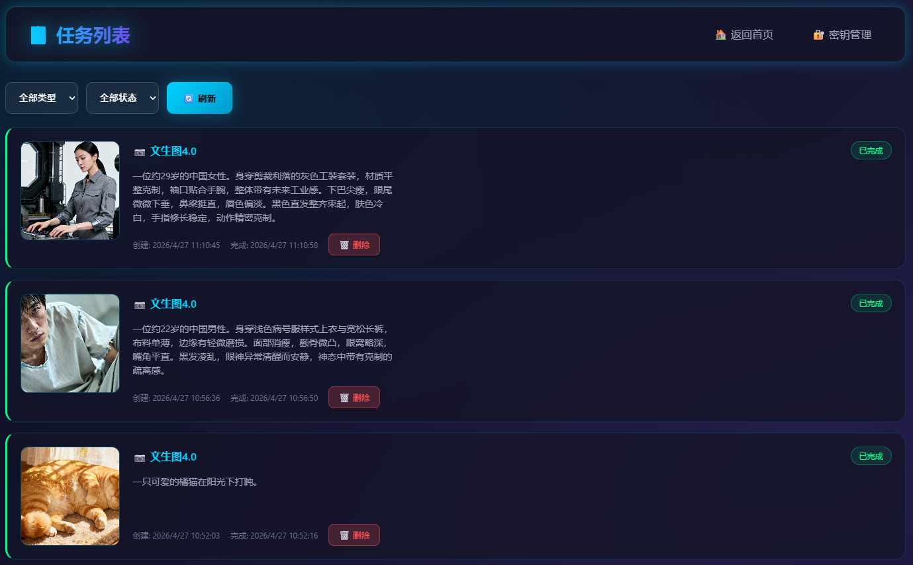
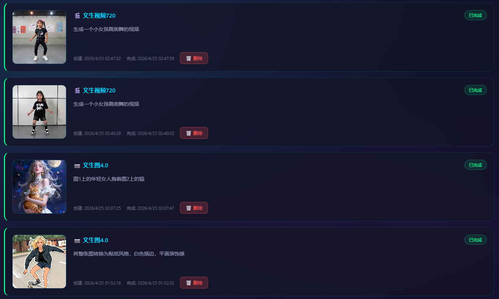

# JimengAI-Local

基于火山引擎即梦AI API的本地化服务，支持生图和生视频功能，提供Web界面管理。

> [!CAUTION]
> 🔥特别注意：生图用的是即梦API里的生图4.0和生图4.6（支持文生图、改图、多参考），生视频用的是即梦API里的生视频3.0和Pro3.0（相当于Seedance1.5Pro，不支持多参）。建议开通免费试用，生图默认200张，生视频默认50秒。

---

## 前置要求

**使用本项目前，必须先开通即梦AI API**

即梦AI API需要通过火山引擎平台开通授权。请访问以下链接：

- [即梦AI开放平台](https://www.volcengine.com/product/jimeng)

开通后获取 `AccessKey` 和 `SecretKey`，用于配置密钥。
- [AK/SK 管理地址](https://console.volcengine.com/iam/keymanage/)

> **注意**：每个项需要单独开通权限，比如“即梦AI-图片生成4.0”、“即梦AI-图片生成4.6”。开通可选择免费试用或者正式调用。

---

## 目录结构

```
jimeng-service/
├── main.go                 # 程序入口
├── go.mod                  # Go模块
├── go.sum                  # 依赖锁定
├── config.yaml             # 配置文件
├── keys.json               # 密钥存储
├── tasks.json              # 任务持久化
├── config/
│   └── config.go          # 配置加载
├── models/
│   ├── task.go            # 任务模型
│   └── apikey.go          # 密钥模型
├── services/
│   ├── signer.go          # 火山引擎签名
│   ├── jimeng.go          # 即梦API客户端
│   └── keypool.go         # 密钥池管理
├── handlers/
│   ├── image.go            # 生图接口
│   ├── video.go            # 生视频接口
│   ├── task.go             # 任务查询
│   └── apikey.go           # 密钥管理
├── static/
│   ├── index.html          # 首页
│   ├── keys.html           # 密钥管理页
│   ├── image.html          # 生图页
│   ├── video.html          # 生视频页
│   ├── tasks.html          # 任务列表页
│   ├── css/style.css       # 样式文件
│   └── js/
│       ├── utils.js        # 工具函数
│       ├── app.js          # 主应用
│       ├── keys.js         # 密钥管理
│       ├── image.js        # 生图功能
│       └── video.js        # 生视频功能
└── uploads/               # 上传目录
```

---

## 技术栈

| 层级 | 技术 |
|------|------|
| 后端框架 | Go + Gin |
| 前端 | 原生 HTML/CSS/JavaScript |
| 数据存储 | JSON 文件持久化 |
| API 签名 | 火山引擎 HMAC-SHA256 |
| 实时通信 | SSE / 轮询 |

## 架构说明

```
┌─────────────────────────────────────────────────────────┐
│                     Web UI                               │
│  (keys.html / image.html / video.html / tasks.html)      │
└─────────────────────┬───────────────────────────────────┘
                      │ HTTP / SSE
┌─────────────────────▼───────────────────────────────────┐
│                    Gin Router                            │
│  ┌──────────┐  ┌──────────┐  ┌──────────┐  ┌─────────┐  │
│  │ API Key  │  │  Image   │  │  Video   │  │  Task   │  │
│  │ Handler  │  │ Handler  │  │ Handler  │  │Handler  │  │
│  └────┬─────┘  └────┬─────┘  └────┬─────┘  └────┬────┘  │
│       │             │             │              │        │
│  ┌────▼─────────────▼─────────────▼──────────────▼────┐   │
│  │                  KeyPool Service                   │   │
│  │  (加权轮询 / 故障隔离 / 配额管理 / 功能级禁用)      │   │
│  └────────────────────┬──────────────────────────────┘   │
│                       │                                   │
│  ┌────────────────────▼──────────────────────────────┐   │
│  │              Jimeng API Client                     │   │
│  │  (HMAC签名 / Base64编码 / 本地文件下载)             │   │
│  └────────────────────┬──────────────────────────────┘   │
└───────────────────────┼───────────────────────────────────┘
                        │ HTTPS
┌───────────────────────▼───────────────────────────────────┐
│              火山引擎即梦AI API                            │
│         https://visual.volcengineapi.com                  │
└───────────────────────────────────────────────────────────┘
```

---

## 核心能力

### 1. 生图功能

- **文生图4.0** - 基于4.0模型的文生图能力
- **生图4.6** - 基于4.6模型的人像写真、平面设计

### 2. 生视频功能

- **文生视频** - 720p/1080p文生视频
- **首帧生视频** - 基于首帧图片生成视频
- **首尾帧生视频** - 基于首尾帧图片生成视频
- **运镜视频** - 多种运镜模板可选
- **3.0Pro** - 专业级视频生成

### 3. 密钥池管理

- 多密钥支持，加权轮询负载均衡
- 功能级故障隔离，单一功能失败不影响其他功能
- 配额管理（生视频按秒、生图片按张）
- 手动重置恢复配额

### 4. 任务管理

- 实时任务状态轮询
- 生成结果预览和下载
- 任务历史记录持久化（重启不丢失）
- 任务删除时自动清理生成的文件

---

## 运行环境要求

- Go >= 1.21
- 能访问 `https://visual.volcengineapi.com`

---

## 快速开始

### 方式一：直接下载运行（推荐）

前往 [Releases 页面](https://github.com/yangjb0913/jimeng-service/releases) 下载对应平台的压缩包，解压后直接运行：

```bash
# Windows
jimeng-service-windows-amd64.exe

# Linux
./jimeng-service-linux-amd64

# macOS
./jimeng-service-darwin-amd64
```

运行后访问 http://localhost:8080

### 方式二：从源码编译

#### 1. 安装依赖

```bash
cd jimeng-service
go mod tidy
```

#### 2. 配置

编辑 `config.yaml`：

```yaml
server:
  host: "0.0.0.0"
  port: 8080

jimeng:
  api_host: "https://visual.volcengineapi.com"
  region: "cn-north-1"
  service: "cv"
  version: "2022-08-31"

upload:
  path: "./uploads"
  max_size: 15728640  # 15MB

keypool:
  data_file: "./keys.json"
  create_sample: true
  default_quotas:
    video_seconds: 50   # 生视频默认50秒
    image_count: 200     # 生图片默认200张
```

#### 3. 启动服务

```bash
go run main.go
```

访问 http://localhost:8080

---

## 页面说明

| 路径 | 说明 |
|------|------|
| `/` | 首页 |
| `/keys.html` | 密钥管理 |
| `/image.html` | 生图页面 |
| `/video.html` | 生视频页面 |
| `/tasks.html` | 任务列表 |

---

## API接口

### 密钥管理

```bash
# 获取密钥列表
GET /api/keys

# 添加密钥
POST /api/keys
Content-Type: application/json
{
  "ak": "你的AccessKey",
  "sk": "你的SecretKey",
  "name": "主密钥",
  "weight": 10
}

# 更新密钥
PUT /api/keys/:id
Content-Type: application/json
{
  "name": "新名称",
  "weight": 8,
  "quotas": {
    "video": {"limit": 100, "used": 0, "enabled": true},
    "image": {"limit": 500, "used": 0, "enabled": true}
  }
}

# 删除密钥
DELETE /api/keys/:id

# 批量导入
POST /api/keys/import
Content-Type: application/json
{"keys": [...]}

# 重置密钥配额
POST /api/keys/:id/reset
```

### 任务接口

```bash
# 提交生图任务
POST /api/image/generate
Content-Type: application/json
{
  "prompt": "一只可爱的橘猫在阳光下打盹",
  "function": "t2i_46",
  "image_urls": [],
  "width": 1024,
  "height": 1024
}

# 提交生视频任务
POST /api/video/generate
Content-Type: application/json
{
  "prompt": "日出时分，海浪拍打礁石",
  "function": "t2v_720",
  "image_urls": [],
  "duration": 5
}

# 查询任务状态
GET /api/task/status/:id

# 获取任务结果
GET /api/task/result/:id

# 上传图片
POST /api/upload
Content-Type: multipart/form-data
```

---

## 配额说明

### 生视频配额
- 默认50秒，按实际生成视频时长扣除
- 配额耗尽后该密钥生视频功能自动失效
- 需要手动重置恢复

### 生图片配额
- 默认200张，按实际生成图片数量扣除
- 配额耗尽后该密钥生图片功能自动失效
- 需要手动重置恢复

## 示例截图

### 生图


### 生视频、改图


---

## 注意事项

1. 首次启动会在 `keys.json` 创建示例密钥，请替换为你的真实火山引擎密钥
2. 上传目录需存在，程序会自动创建
3. 视频URL有效期为1小时，图片URL有效期为24小时
4. 任务状态轮询间隔3秒，超时时间5分钟
5. 任务删除时会同时删除生成的图片和视频文件

---

## 许可证

本项目基于 MIT 许可证开源，详见 [LICENSE](LICENSE) 文件。
